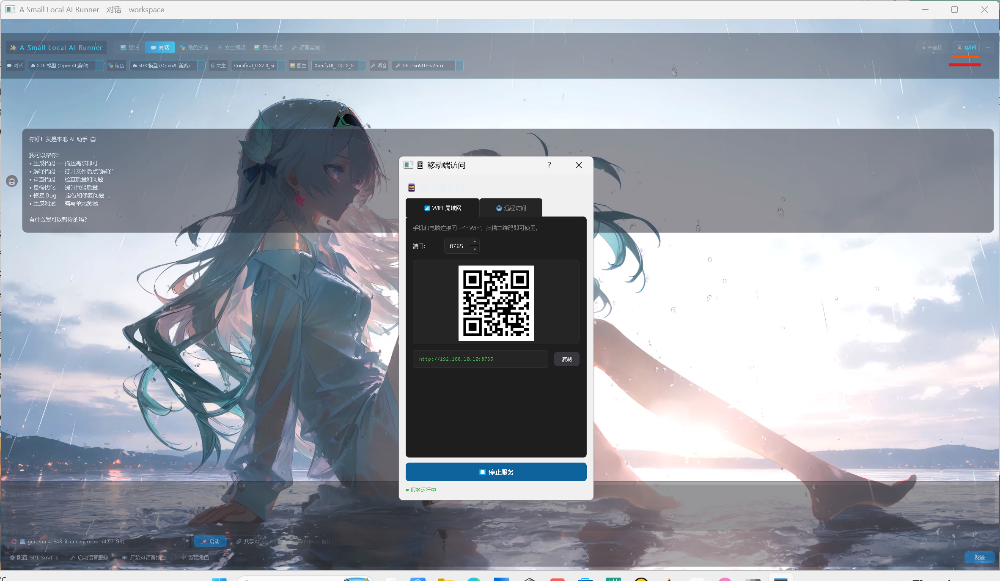

# 🎮 AI Chat — A Small Local AI Runner

PyQt5 本地桌面 AI 应用，集成调用本地模型实现 **AI 对话 / 角色扮演 / 文生视频 / 图生视频 / 语音合成** 五大功能模块，无浏览器依赖，支持动态壁纸桌面美化。


## ✨ 功能特性

| 模块              | 说明                                                    |
| --------------- | ----------------------------------------------------- |
| 💬 **AI 对话**    | 使用本地 LLM（llama-server）进行流式对话，支持思考过程可视化                |
| 🎭 **角色扮演对话**   | 角色卡模板 + 世界书 + 游戏式 prompt 组装                           |
| 🎬 **文生视频**     | 使用 ComfyUI 调用 LTX-Video + Sulphur 2 模型                |
| 🖼 **图生视频**     | 同上，额外上传首帧并注入 LoadImage 节点                             |
| 🎤 **语音系统**     | 使用 CosyVoice（中文零样本克隆）/ GPT-SoVITS-v2pro（多语种 v2Pro 克隆） |
| 🖼 **壁纸与外观**    | Wallpaper Engine pkg 导入 + 互动透视壁纸 + 文字透明度补偿            |
| 📱 **手机 Web 版** | FastAPI 局域网服务，同一 WiFi 下扫码即可对话                         |

***

## 📢 工具定位声明

> **本程序是一个"模型调用聚合工具"，不参与任何 AI 模型的开发、训练或修改。**
>
> - 💬 **LLM**（Gemma / Qwen 等）：通过 llama.cpp / llama-server 调用 GGUF 格式的第三方模型
>
> - 🎤 **语音**（GPT-SoVITS-v2pro / CosyVoice）：通过 HTTP API 调用第三方开源语音合成服务
>
> - 🎬 **视频**（Sulphur 2 / LTX-Video）：通过 ComfyUI 的 API 调用第三方视频生成模型
>
> - 🖼 **壁纸**：读取 Wallpaper Engine 订阅下载的作者原创作品
>
> 所有模型的版权、许可证和下载入口均归其**原作者/机构**所有，本程序仅提供统一的图形界面来**使用**这些模型。请在使用前仔细阅读各模型的许可证（部分模型禁止商用）。

## 📱 手机 Web 版（同 WiFi 网页对话）

程序内置 FastAPI 服务，可让手机/平板/其他设备在同一局域网内通过浏览器与本地 AI 对话，桌面端模型作为后端统一响应。



### 功能特点

- ✅ **WiFi 局域网模式**：手机和电脑在同一 WiFi 下，扫码即可进入手机版对话界面

- ✅ **二维码扫码**：桌面端弹出「移动端访问」对话框，直接扫码免输入地址

- ✅ **手机版 UI**：针对触屏优化的简洁对话界面，支持流式输出和历史记录

### 使用方式

1. 顶栏菜单 → **「移动端访问」**（或工具栏二维码图标）
2. 选择 **「WiFi 局域网」**
3. 手机扫描二维码 → 进入手机版对话界面开始使用

## 🚀 快速开始

### 1. 安装依赖 & 启动（推荐）

```bash
python install_and_launch.py
```

点击「📦 安装依赖」→ 点击「🚀 启动 AI Chat」

### 2. 手动启动

```bash
pip install -r AI_Chat/requirements.txt
cd AI_Chat
python app.py
```

### 3. 启动后直接使用

启动程序后，所有功能通过界面操作即可，详见下方模型下载指南。

***

## 📁 完整文件结构

```
AI_Chat/                              ← 项目根目录（仓库根）
│
├── .gitignore
├── README.md                         ← 你正在读的文件
├── install_and_launch.py             ← ⭐ 一键安装依赖 + 启动
│
├── .git/                             ← Git 仓库（自动生成）
│
├── llama-b9381-bin-win-cuda-13.3-x64/  ← llama.cpp 官方二进制（b9381）
│   ├── llama-server.exe              ← LLM 服务核心
│   ├── llama-cli.exe                 ← 命令行工具
│   ├── llama.dll / ggml*.dll         ← 运行库
│   └── cublas64_13/ cublasLt64_13/ cudart64_13  ← CUDA 13.3 DLL
│
├── Background_Recommend/             ← Wallpaper Engine 壁纸推荐目录
├── Basic_Card_AI_Women/              ← AI 角色女性卡模板（SteamGridDB）
├── Basic_Card_Player_Man/            ← AI 角色男性卡模板（SteamGridDB）
├── charter/                          ← 角色模板目录（新建角色读取这里）
├── docs/                             ← 文档和截图
│   └── screenshots/
│       └── main界面.png              ← 程序运行截图
├── llama.cpp-master/                 ← llama.cpp 源码参考（可选，不影响运行）
├── Sound/                            ← 音效目录
├── Sounds_of_GPT_SoVITS_v2pro/       ← GPT-SoVITS 默认参考音频
├── 程序环境需求软件SoftWarePackges/    ← 依赖软件（FFmpeg / ImageMagick 等）
│
├── AI_Chat/                          ← ⭐ 源代码（全部 Python）
│   ├── app.py                        ← 入口（全局异常钩子 + QApplication）
│   ├── launcher.py                   ← 依赖检查 + llama-server 定位
│   ├── main.py                       ← MainWindow（顶栏两行 + 6 选项卡 + 窗口级壁纸）
│   ├── gui_launcher.py               ← tkinter 简易启动器（无 PyQt 时 fallback）
│   ├── ComfyUI_ITX2.3_Sulphur 2_TexttoVideo.json   ← 文生视频 Workflow
│   ├── ComfyUI_ITX2.3_Sulphur 2_PicturetoVideo.json ← 图生视频 Workflow
│   ├── requirements.txt              ← Python 依赖列表
│   ├── start.bat / start-all.bat     ← Windows 启动脚本
│   ├── core/                         ← ⭐ 核心逻辑层
│   │   ├── config.py                 ← ConfigManager 单例（点路径 get/set）
│   │   ├── server_manager.py         ← llama-server 进程管理
│   │   ├── llm_client.py             ← OpenAI 兼容流式客户端
│   │   ├── character_manager.py      ← 角色卡 + 世界书 + 游戏 prompt
│   │   ├── tts_installer.py          ← CosyVoice 安装器
│   │   ├── tts_server_manager.py     ← CosyVoice 服务管理
│   │   ├── tts_client.py             ← CosyVoice HTTP 客户端
│   │   ├── gpt_sovits_server_manager.py  ← GPT-SoVITS 服务管理
│   │   ├── gpt_sovits_client.py      ← GPT-SoVITS HTTP 客户端
│   │   ├── comfyui_client.py         ← ComfyUI API 客户端
│   │   ├── model_manager.py          ← Sulphur 2 模型检测/复制
│   │   ├── system_monitor.py         ← psutil 监控
│   │   ├── we_pkg_extract.py         ← Wallpaper Engine pkg 解包
│   │   ├── theme_manager.py          ← 主题管理
│   │   ├── text_opacity.py           ← 文字透明度补偿
│   │   └── api_server.py             ← 内嵌 API
│   ├── widgets/                      ← ⭐ UI 层
│   │   ├── ai_panel.py               ← 💬 对话 + 🎭 角色扮演 面板
│   │   ├── video_panel_v2.py         ← 🎬 文生视频 + 🖼 图生视频 面板（当前生效版）
│   │   ├── video_setup_wizard.py     ← ComfyUI workflow 向导
│   │   ├── tts_panel.py              ← 🎤 语音系统 面板
│   │   ├── tts_install_panel.py      ← CosyVoice 分步安装面板
│   │   ├── wallpaper_panel.py        ← 🖼 壁纸与外观 面板
│   │   ├── animated_bg.py            ← 窗口级壁纸（图片/视频 + 互动透视层）
│   │   ├── wallpaper_import_dialog.py ← 壁纸导入对话框
│   │   ├── character_dialog.py       ← 新建/管理角色
│   │   ├── settings_dialog.py        ← 设置对话框（模型管理 + 主题 + 服务）
│   │   ├── setup_wizard.py           ← 首次启动向导
│   │   └── web_server_dialog.py      ← 手机版服务对话框
│   ├── charter/                      ← 内置角色模板
│   ├── workspace/                    ← 对话历史 + 角色会话记录（运行时生成）
│   ├── web/                          ← 手机版 FastAPI 服务
│   │   └── web_server.py
│   └── cosyvoice_service/             ← CosyVoice FastAPI 服务（独立 conda 进程）
│       └── server.py
│
└── models/                            ← ⚠️ 模型目录（需自行下载，见下方指南）
    ├── .gitkeep                       ← git 占位（模型文件不入库）
    ├── gemma-4-E4B-it-uncensored-Q4_K_M.gguf                    ← Gemma 4 E4B LLM（~5 GB）
    ├── Qwen3.6-35B-A3B-Uncensored-HauhauCS-Aggressive-IQ2_M.gguf  ← Qwen3.6 35B LLM（~11 GB）
    ├── mmproj-Qwen3.6-35B-A3B-Uncensored-HauhauCS-Aggressive-f16.gguf  ← Qwen3.6 多模态投影（~858 MB）
    ├── ComfyUI/                       ← ComfyUI 实例目录（运行时生成）
    ├── Sulphur 2/                     ← 视频模型（README 里有下载链接）
    ├── GPT-SoVITS-v2pro/              ← 语音模型整合包
    └── CosyVoice/                     ← CosyVoice 语音模型
```

***

## 🧠 模型下载 & 放置指南

> ⚠️ 所有模型文件不随 GitHub 仓库分发（单文件超 100MB / 总计超 90GB），请按下方链接自行下载后放入对应目录。本程序**仅负责调用**这些模型，不参与开发，版权归各原作者所有。

### 一、使用 LLM 对话模型（llama.cpp / GGUF 格式）

**程序里使用方式**：顶栏第二行 → 💬 对话 / 🎭 角色扮演 下拉框选择已放置的 .gguf 文件

| 模型                                      | 大小       | 下载链接                                                                                                      | 放入目录      |
| --------------------------------------- | -------- | --------------------------------------------------------------------------------------------------------- | --------- |
| **Gemma 4 E4B Uncensored (Q4\_K\_M)**   | \~5 GB   | ⚠️ **[第三方教程/下载页 - HuggingFace](https://huggingface.co/TrevorJS/gemma-4-E4B-it-uncensored-GGUF)**（本站非模型作者） | `models/` |
| **Qwen3.6-35B A3B Uncensored (IQ2\_M)** | \~11 GB  | ⚠️ **[第三方教程/下载页 - CSDN](https://blog.csdn.net/weixin_41961749/article/details/161501525)**（本站非模型作者）       | `models/` |
| **mmproj-Qwen3.6**（多模态投影）               | \~858 MB | 随 Qwen3.6 一起下载                                                                                            | `models/` |

放置后启动程序会**自动扫描** `models/` 下所有 `.gguf` 文件填入下拉框。

***

### 二、使用 llama-server.exe（LLM 推理引擎）

**程序里使用方式**：自动定位（`launcher.py` 扫描常见路径），或手动指定

| 资源                                                 | 下载链接                                                       | 放入目录                                       |
| -------------------------------------------------- | ---------------------------------------------------------- | ------------------------------------------ |
| **llama.cpp Windows CUDA 13.3 预编译 + CUDA DLL（官方）** | <https://github.com/ggml-org/llama.cpp/releases/tag/b9381> | 项目根目录 `llama-b9381-bin-win-cuda-13.3-x64/` |

需要下载两个官方 release 资源合并解压到同一文件夹：`llama-b9381-bin-win-cuda-13.3-x64.zip` + `cudart-llama-bin-win-cuda-13.3-x64.zip`。当前项目使用纯官方原版（b9381, commit `91eb8f4fa`），无第三方修改。

***

### 三、使用 GPT-SoVITS-v2pro（多语种语音克隆）⭐ 推荐

**程序里使用方式**：🎤 语音系统 → 顶栏选 GPT-SoVITS-v2pro → 配置整合包路径 + 权重 + 参考音频 → 启动服务，即可在对话中调用

> ⚠️ **必须先把整合包解压**，将解压后的文件夹完整放入 `models/GPT-SoVITS-v2pro/` 目录（文件夹内应直接包含 `api.py`、`runtime/`、`GPT_SoVITS/` 等内容，不能多嵌一层目录）。

| 资源                              | 下载链接                                                                                                                                                                    | 放入目录                         |
| ------------------------------- | ----------------------------------------------------------------------------------------------------------------------------------------------------------------------- | ---------------------------- |
| **完整整合包下载（含 runtime + api.py）** | ⚠️ **[第三方教程页 - x-jzy.github.io](https://x-jzy.github.io/2025/10/31/GPT-SoVITS%E7%9A%84%E6%9C%AC%E5%9C%B0%E9%83%A8%E7%BD%B2%E4%B8%8E%E4%BD%BF%E7%94%A8/)**（本站非模型作者，仅供参考） | `models/GPT-SoVITS-v2pro/`   |
| **🎭 角色 GPT-SoVITS 模型库（热门）**    | **<https://www.ai-hobbyist.com/>**（第三方模型分享站）                                                                                                                            | 下载 `.ckpt` + `.pth` 放入对应权重目录 |

整合包解压后目录结构：

```
models/GPT-SoVITS-v2pro/           ← 解压后直接是这个目录结构（不要套娃！）
├── api.py / api_v2.py / webui.py
├── runtime/                          ← 自带 Python 3.9 + PyTorch CUDA（无需自己装）
├── GPT_SoVITS/pretrained_models/     ← 基础预训练模型（整合包已带）
├── GPT_weights_v2Pro/               ← 📥 你的角色 GPT 权重（.ckpt）
│   └── 你的角色-e10.ckpt
├── SoVITS_weights_v2Pro/             ← 📥 你的角色 SoVITS 权重（.pth）
│   └── 你的角色_e10_s940.pth
└── tools/uvr5/uvr5_weights/         ← 人声分离模型（可选）
```

**程序里还需要配置**：

| 配置项              | 说明                | 示例                                       |
| ---------------- | ----------------- | ---------------------------------------- |
| 整合包路径            | 含 api.py 的目录      | `models/GPT-SoVITS-v2pro`                |
| SoVITS 权重 (.pth) | v2Pro 格式          | `SoVITS_weights_v2Pro/你的角色_e10_s940.pth` |
| GPT 权重 (.ckpt)   | v2Pro 格式          | `GPT_weights_v2Pro/你的角色-e10.ckpt`        |
| 默认参考音频           | 3-5 秒干净 wav       | 角色的一段录音                                  |
| 默认参考文本           | 音频里说的话（精确匹配）      | `"可恶，怎么又是盗宝团！"`                          |
| 默认参考语种           | zh / en / ja / ko | `zh`                                     |

**⚠️ 重要**：参考音频建议 3-5 秒、单句、无背景噪音。每次合成都**不传**参考参数（让服务用启动时 `-dr/-dt/-dl` 设置的 default\_refer），否则每次会重新 zero-shot 克隆，长参考音频的尾部内容会被当作"固定前缀"注入输出。

***

### 四、使用 CosyVoice2 / CosyVoice3（中文零样本语音克隆）

**程序里使用方式**：🎤 语音系统 → 顶栏选 CosyVoice → 配置 repo 路径 + 模型目录 → 启动服务，即可在对话中调用

> ⚠️ **必须先安装 Miniconda/Anaconda**（<https://docs.conda.io/en/latest/miniconda.html>），CosyVoice 依赖 conda 创建独立 Python 环境（程序内置安装器会自动帮你装 git + clone 仓库 + 创建 conda 环境 + 下载模型，也可以手动操作）。

| 资源                               | 下载链接                                                                                                 | 放入目录                                                           |
| -------------------------------- | ---------------------------------------------------------------------------------------------------- | -------------------------------------------------------------- |
| **CosyVoice 官方仓库**               | <https://github.com/QwenAudio/CosyVoice>（阿里达摩院出品）                                                    | 解压后放入 `models/CosyVoice/`                                      |
| **Fun-CosyVoice3-0.5B-2512（推荐）** | ⚠️ **[第三方模型页 - ModelScope](https://www.modelscope.cn/models/iic/Fun-CosyVoice3-0.5B-2512)**（本站非模型作者） | `models/CosyVoice/pretrained_models/Fun-CosyVoice3-0.5B-2512/` |
| **CosyVoice2-0.5B**              | 同上                                                                                                   | `models/CosyVoice/pretrained_models/CosyVoice2-0.5B/`          |

**目录结构**（解压 CosyVoice 仓库后）：

```
models/CosyVoice/
├── cosyvoice/                       ← 源码目录（解压仓库直接放入）
├── third_party/
├── pretrained_models/
│   ├── Fun-CosyVoice3-0.5B-2512/    ← 📥 下载的模型文件放这里
│   └── CosyVoice2-0.5B/             ← 或选 CosyVoice2
├── server.py                        ← 服务入口（程序会自动启动）
└── ...其他仓库文件
```

程序内置 CosyVoice 安装器（🎤 语音系统 → CosyVoice 配置组 → 分步安装），三步自动完成：克隆仓库 → 创建 conda 环境 + 安装依赖 → 下载预训练模型。一键安装按钮搞定一切。

***

### 五、使用 ComfyUI + Sulphur 2 生成视频

**程序里使用方式**：🎬 文生视频 / 🖼 图生视频 → 启动向导 → 加载 workflow → 填入模型路径 → 调用 ComfyUI API 生成

> ⚠️ **必须先启动 ComfyUI 桌面端**（后台 API 服务），否则视频生成不可用。程序只是调用 ComfyUI 的 API 接口，真正的推理由 ComfyUI 完成。

**1. 安装 ComfyUI 桌面版**：<https://github.com/comfyanonymous/ComfyUI>

**2. Sulphur 2 模型文件（仅 1 个，直接放入** **`models/Sulphur 2/`** **目录，程序会自动复制到 ComfyUI 对应位置）**：

| 模型文件                                             | 大小      | 下载链接                                                                                   |
| ------------------------------------------------ | ------- | -------------------------------------------------------------------------------------- |
| **10Eros\_v1.4\_DMD\_int8\_convrot.safetensors** | \~27 GB | ⚠️ **[第三方分享页 - macin.top](https://macin.top/posts/e6671f22/index.html)**（本站非模型作者，仅供参考） |

**程序内模型放置流程**：`models/Sulphur 2/` → 向导第三步「一键复制缺失文件」→ 自动分发到 ComfyUI 的 `checkpoints/` 目录。

**3. 另外三个模型（在 ComfyUI 中单独下载）**：

- `gemma-3-12b-it-ablit-norms-biproj-fp8mixed.safetensors`（文本编码器，放 `text_encoders/`）

- `ltx-2.3-22b-distilled-lora-384.safetensors`（LoRA，放 `loras/`）

- `ltx-2.3-spatial-upscaler-x2-1.1.safetensors`（超分，放 `checkpoints/`）

Workflow 模板：程序已内置两份 JSON（仓库根目录 `AI_Chat/` 下），也可在 ComfyUI 里导出 API 格式。

**目录结构**：

```
models/Sulphur 2/                      ← 把网上下载的压缩包解压，里面的 safetensors 文件直接放这里
└── 10Eros_v1.4_DMD_int8_convrot.safetensors
```

***

## 🖼 壁纸系统说明（重要！）

> ⚠️ **本程序的壁纸功能是通过读取 Wallpaper Engine 订阅时下载的文件夹来工作的**。
>
> 也就是说，本程序本身**不提供**壁纸资源。你需要：
>
> 1. 先在 **Wallpaper Engine**（Steam 版）里订阅喜欢的壁纸作者的作品
> 2. 程序的「📁 导入 Wallpaper Engine 壁纸文件夹」按钮会自动扫描你电脑上 Wallpaper Engine 的下载目录
> 3. **使用壁纸前，请务必在 Wallpaper Engine 中关注/订阅该作者**，尊重原创劳动成果

程序支持的壁纸类型：

- 📸 **静态图片壁纸**（Wallpaper Engine pkg 格式，程序会自动提取预览图）

- 🎬 **动态视频壁纸**（直接支持 mp4/avi 等格式）

- 🖱 **互动透视壁纸**（移动鼠标时有光晕跟随效果）

***

## 🛠 依赖清单

| 包          | 版本       | 用途           |
| ---------- | -------- | ------------ |
| PyQt5      | ≥5.15.0  | GUI 框架       |
| QScintilla | ≥2.13.0  | 代码编辑器        |
| requests   | ≥2.28.0  | HTTP 客户端     |
| chardet    | ≥5.0.0   | 字符编码检测       |
| psutil     | ≥5.9.0   | 系统监控         |
| fastapi    | ≥0.100.0 | Web 服务器（手机版） |
| uvicorn    | ≥0.23.0  | ASGI 服务器     |

## ⌨️ 快捷键

| 快捷键    | 功能        |
| ------ | --------- |
| Ctrl+0 | 🖼 壁纸与外观  |
| Ctrl+1 | 💬 对话     |
| Ctrl+2 | 🎭 角色扮演对话 |
| Ctrl+3 | 🎬 文生视频   |
| Ctrl+4 | 🖼 图生视频   |
| Ctrl+5 | 🎤 语音系统   |

***

## 🙏 致谢 / 来源

本程序基于以下第三方公开资源**进一步开发**：

| 模块                         | 来源                                                                                               | 说明                                                                                                                                                              |
| -------------------------- | ------------------------------------------------------------------------------------------------ | --------------------------------------------------------------------------------------------------------------------------------------------------------------- |
| **llama-server**（LLM 推理引擎） | 官方 [ggml-org/llama.cpp](https://github.com/ggml-org/llama.cpp) b9381 release（commit `91eb8f4fa`） | 使用纯官方原版二进制（`llama-b9381-bin-win-cuda-13.3-x64.zip` + `cudart-llama-bin-win-cuda-13.3-x64.zip` 合并），无第三方修改                                                        |
| **GPT-SoVITS-v2pro**       | 开源社区 + 第三方整合包                                                                                    | 整合包下载：⚠️ **[第三方教程页 - x-jzy.github.io](https://x-jzy.github.io/2025/10/31/GPT-SoVITS%E7%9A%84%E6%9C%AC%E5%9C%B0%E9%83%A8%E7%BD%B2%E4%B8%8E%E4%BD%BF%E7%94%A8/)** |
| **CosyVoice**              | 阿里达摩院 [QwenAudio/CosyVoice](https://github.com/QwenAudio/CosyVoice)                              | 官方开源项目                                                                                                                                                          |
| **Sulphur 2 / LTX-Video**  | 开源社区模型                                                                                           | 下载：⚠️ **[第三方分享页 - macin.top](https://macin.top/posts/e6671f22/index.html)**                                                                                     |
| **ComfyUI**                | [comfyanonymous/ComfyUI](https://github.com/comfyanonymous/ComfyUI)                              | 官方开源项目                                                                                                                                                          |

> 上述第三方下载链接均为社区教程/分享页面，**本程序作者与这些第三方网站无关**，请自行甄别内容可靠性。所有 AI 模型版权归各自原作者/机构所有。

***

## 📄 License

GPL-3.0
